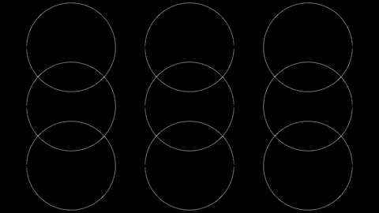
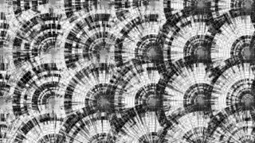

# GeomeX
Source code of my entry to Graffathon which got the 3rd place (There were a total of 32 entries).

Here are two GIF screen captures of the demo:

You can watch it in high quality and sound on 
[YouTube](https://www.youtube.com/watch?v=InN-bmRk2lQ).

Dependencies
------------

In order to be able to run the project you need to have 
[Moonlander](https://github.com/anttihirvonen/moonlander). 
Moonlander is a library that integrates Processing with GNU Rocket to allow time-based variables in sketches. Moonlander should be inside the library directory of Processing's sketchbooks path.
In addition, you need the minim libarary installed 
(available within Processing extensions)

Music
-----
Music used as soundtrack is [Stumblefather – Intermission 2 - Vejo!](https://www.jamendo.com/track/106840/stumblefather-intermission-2-vejo-syntax_the_nerd-elementar-spin-edit) 
and it's licensed under [Creative Commons Attribution 2.5](https://creativecommons.org/licenses/by/2.5/)

License
-------
This project uses the [MIT License](LICENSE)